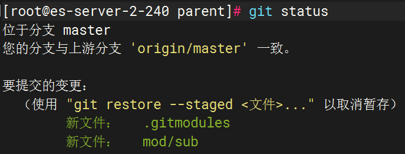
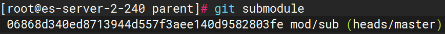
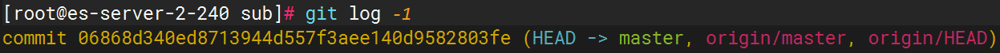
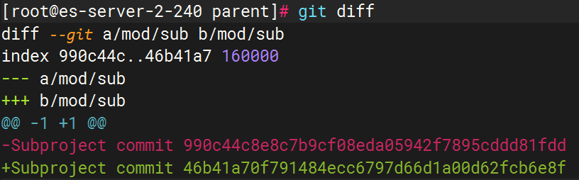
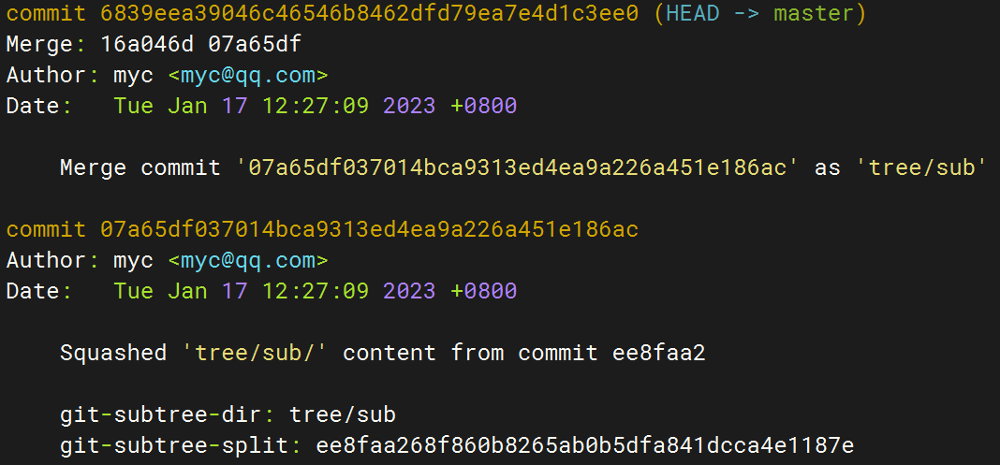

## 1. 用户信息
```Shell
#全局配置
git config --global user.email "xxx@xx.com"
git config --global user.name "Xxx"
#保存在：~/.gitconfig
```
```Shell
#指定库配置，首先进入库目录，然后：
git config user.email "xxx@xx.com"
git config user.name "Xxx"
#保存在：.git/.gitconfig
```
## 2. 记住密码
```Shell
#全局配置
git config --global credential.helper store
#下次输入用户和密码后就会保存在：~/.git-credentials
#若要删除保存且不再记住密码只需要：
#   删除整个文件：~/.git-credentials
#   或
#   删除文件 ~/.gitconfig 的下面两行：
#       [credential]
#           helper = store
```
```Shell
#指定库配置，首先进入库目录，然后：
git config credential.helper store
#下次输入用户名密码后就会保存在：.git/config
```
## 3. 提交 commit
```Shell
#查看修改的内容
git diff
#添加指定修改到暂存区
git add [file/dir]
#添加所有修改到暂存区（.指的是当前文件夹，下同，注意执行命令时所在的路径）
git add .
#提交已暂存的修改，加参数-a可以将修改但未暂存的一起提交，新增文件则必须add暂存后才能提交
git commit -m "提交日志"
#从远程仓库同步到本地
git pull
#推送本地分支master的更新到远程仓库origin的同名分支，推送前确保同步了远程仓库的最新版本
git push origin master
#通常不会直接修改master分支，而是新建一个本地分支（比如dev）进行修改，之后合并到本地master再push
```
## 4. 分支 branch
```Shell
#显示本地分支，-r 显示远程分支，-a 显示本地和远程分支
git branch
#从当前分支，创建dev分支，并切换到dev分支
git checkout -b dev
#切换到已存在的分支
git checkout master
#将分支master同步到远程仓库origin
git push origin master
#将分支dev同步到远程仓库origin
git push origin dev
#删除本地分支dev
git branch -d dev
#将远程仓库origin的分支dev克隆到本地，在本地命名为分支dev
git checkout -b dev origin/dev
#删除远程仓库的分支dev
git push origin --delete dev
```
## 5. 标签 tag
```Shell
#显示所有tag
git tag
#从当前分支，创建一个tag
git tag -a release-v1.0.0 -m "创建版本1.0.0的标签"
#将指定tag同步到远程仓库origin
git push origin release-v1.0.0
#将所有tag同步到远程仓库origin
git push origin --tags
#删除指定tag
git tag -d release-v1.0.0
#删除远程仓库origin的指定tag，注意不能少了tag前的冒号
git push origin :release-v1.0.0

#若需要基于某个tag进行修改，请从该tag创建一个分支，在新分支修改后提交，测试没问题后删除旧tag，重新添加同名tag
#从指定tag创建一个新分支
git checkout -b dev-v1.0.0 release-v1.0.0
```
## 6. 日志 log
```Shell
#显示当前分支所有提交历史，超过一屏回车键下滚，按q退出
git log
#显示最新的10个提交历史
git log -10
#显示最新的2个提交的详细信息，
git log -2 -p
#查找提交日志中包含"订单"关键字的记录
git log --grep="订单"
#检索记录，并单行简介显示（commit_id也是缩短版的，但在需要指定id的命令中也是有效可用的）
git log --oneline --grep="订单"
#详细显示指定记录的信息，包括文件内容的具体变更
git show [commit_id]
#对比两次提交的内容
git diff [commit_id_2] [commit_id_2]

#检出指定版本的内容到工作区（也适用于tag），可以查看但不要修改，因为当前处于一个临时分支
git checkout [commit_id]
#创建一个新分支，然后就是熟悉的流程了：修改、提交、合并
git checkout -b fix

#更多 git log 用法
#单行简介显示，并绘制图形展示分支结构
git log --oneline --graph
#按提交者分类显示历史记录
git shortlog
#显示指定日期之后的记录，--since同义
git log --after="2020-01-01"
#显示指定日期之前的记录，--until同义
git log --before="2020-01-31"
#显示指定区间内的记录
git log --after="2020-01-01" --before="2020-01-31"
```

## 7. 远程仓库 remote
```Shell
#显示远程仓库，默认是一个名为origin的远程仓库，它指向克隆出来的地址
git remote -v
#显示本地和远程仓库的所有分支（克隆出来默认只有一个master分支）
git branch -a
#将远程仓库origin的分支dev克隆到本地，在本地命名为分支dev
git checkout -b dev origin/dev
#添加一个名为ali的远程仓库，指向阿里云的代码托管平台
git remote add ali https://code.aliyun.com/letmehold/test.git
#将所有分支推送到远程仓库ali
git push --all ali
#将远程仓库origin重命名为github
git remote rename origin github
#删除远程仓库ali
git remote rm ali
```
## 8. 合并 merge
```Shell
#假设位于分支master
#合并dev分支到当前分支；默认快进式合并，保留dev的commit，不会产生新的commit
git merge dev
#关闭快进式合并，保留dev的commit，产生新的commit
git merge dev --no-ff
#压缩合并，不保留dev的commit，产生新的commit
git merge dev --squash
```
## 9. 撤销回滚
```Shell
#修改后，未暂存
#还原指定文件的改动
git checkout [file/dir]
#还原所有改动
git checkout .

#已暂存，未提交
#将指定文件撤出暂存区
git reset [file/dir]
#将所有文件撤出暂存区
git reset .
# 撤出暂存区后，就可以用checkout还原修改

#已提交
#将指定commit_id的版本内容覆盖到本地，并转到填写提交日志的步骤
git revert [commit_id]
#revert是覆盖后再提交的过程，会多一次提交

#彻底舍弃，重置到指定的版本，晚于该版本的提交、暂存区的内容以及工作区的修改全部彻底丢弃（慎用）
git reset --hard [commit_id]

#通常来说彻底舍弃是没必要的，revert后重新提交即可，这样可以保留所有历史
# git reset 是一个功能强大的命令，但理解不够容易造成困惑甚至灾难，没把握的情况下建议仅用于撤销暂存区
```
## 10. 子库
### 10.1. 拆分
&emsp;&emsp;不保留历史记录的拆分直接把目录拷贝出去重新初始化一个库即可；如果需要保留，一般当然是只留待拆分目录的历史记录，可以用subtree来实现；在centos或类似系统，subtree需要额外安装。
```Shell
yum install git-subtree
```
&emsp;&emsp;假设有一个库parent，其中有一个目录sub，现在把sub拆分为子库并保留sub目录的历史提交记录：
```Shell
cd parent
#筛选出包含sub目录的历史提交，放到一个新建的分支
git subtree split -P sub/ -b branch-sub
#新建一个库（也就是子库）
cd ..
mkdir sub
cd sub/
git init
#将新建的分支导进来
git pull ../parent/ branch-sub

# branch-sub分支没用了
cd ../parent/
git checkout master
git branch -D branch-sub
```
把两个库放到远程仓库，作为下文示例：  
* https://gitee.com/eosino/parent.git  
* https://gitee.com/eosino/sub.git  
### 10.2. submodule
submodule是先于subtree出现的子库方案，直接集成在git包中，原理是把子库的一个commit保存在主库。
```Shell
cd parent
# 添加submodule，路径位于主库的parent/mod/sub
git submodule add https://code.qingfengtec.com/ma.yc/sub.git mod/sub
# 此时执行git status可以看到如下图1所示的变动，所以还需要一次提交
git commit -m 'add submodule mod/sub'
git submodule                # 查看子库信息，如下图2
# 进入子库目录parent/mod/sub，这个目录本质是一个把sub库clone到了本地
cd mod/sub/
git log -1                # 查看子库的log，如下图3，可以看到与图2记录的commitid一致
```
<div>



</div>
主库仅仅是通过commitid对子库进行引用，之后，直接修改子库，或者在主库中修改子库（提交、更新、切换分支等），都会改变这个commitid，需要对主库进行一次提交：
<div>

</div>
明白了原理，当子库有更新，主库同步的方式就是：进入子库目录执行git pull，然后返回主库目录提交commitid的变更即可。
```Shell
# 默认clone不会拉取子库，仅创建一个空目录；需要加上参数--recurse-submodule
git clone --recurse-submodules https://code.qingfengtec.com/ma.yc/parent.git
# 若clone时未带参数--recurse-submodule，也可以在clone后执行下面的命令来拉子库
git submodule update --init
# 注：拉子库到本地默认处于对应commitid的游离分支，不要直接修改

# 查看所有子库的信息
git submodule

# 当子库较多时可以用foreach批量对子库执行命令
git submodule foreach 'git pull'
```
删除子库的步骤如下：
```Shell
git submodule deinit mod/sub
git rm mod/sub
git commit -m 'remove submodule mod/sub'
```
### 10.3 subtree
&emsp;&emsp;submodule更符合直观理解的子库概念，主库仅仅是通过commitid引用，但也是因为只有commitid，实际使用过程中若对submodule理解不深，容易出现很多冲突，而且子库更新还必须修改一次主库引用的commitid；相对而言subtree则可以对编码者屏蔽细节（复杂留给同步），使更多实践偏向使用subtree。  
&emsp;&emsp;上文已经使用过subtree来拆分子库，使用subtree的子库方案本质上是把子库代码复制一份放到主库指定目录，有修改及时同步（或者叫合并），主库和子库之间并没有任何配置关联，只有在同步时指定主库目录和子库地址进行一次合并。  
&emsp;&emsp;相对submodule，subtree可以让主库和子库的使用者不关心他们的关系，直接按普通git库操作即可，只需要及时或定时同步；但复杂易出问题的细节只是隐藏在了同步这一环罢了，还有主库push到子库需要遍历提交记录找出与子库目录相关的日志去同步，容易有性能问题。
```Shell
# 主库增加子库的远程仓库
git remote add sub https://code.qingfengtec.com/ma.yc/sub.git
# 主库增加一个subtree子库，会自动产生两次提交，如下图1
git subtree add --prefix=tree/sub sub master --squash

# 主库拉取子库的更新
git subtree pull --prefix=tree/sub sub master --squash
# 主库推送更新到子库
git subtree push --prefix=tree/sub sub master --squash
```
<div>

</div>