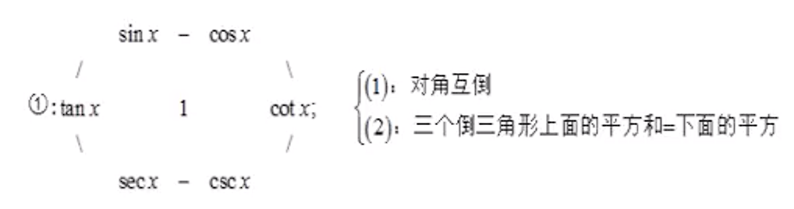
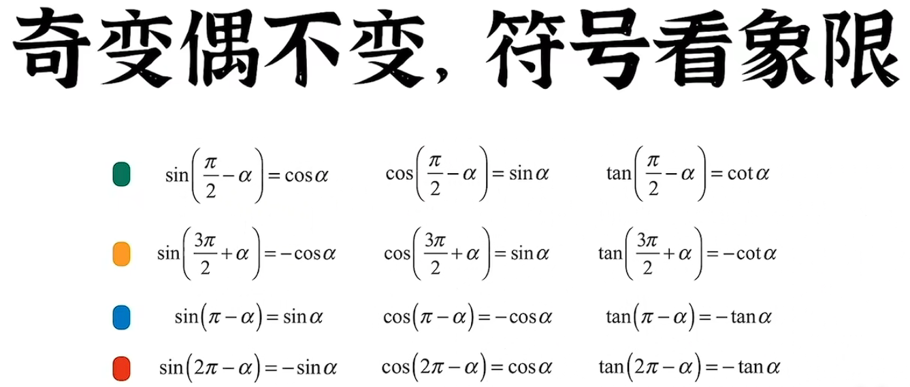
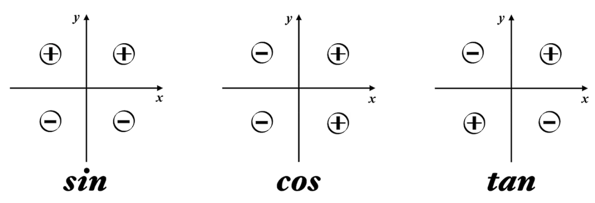

# 1. 求导公式
<div>

</div>

|  |  |  |
|--|--|--|
| $(\frac{1}{x})'=-\frac{1}{x^2}$ | $(\tan{x})'=\sec^2{x}$ | $(\arcsin{x})'=\frac{1}{\sqrt{1-x^2}}$ |
| $(\sqrt{x})'=\frac{1}{2\sqrt{x}}$ | $(\cot{x})'=-\csc^2{x}$ | $(\arccos{x})'=-\frac{1}{\sqrt{1-x^2}}$ |
| $[\ln{(x+\sqrt{x^2 \pm a^2})}]'=\frac{1}{\sqrt{x^2 \pm a^2}}$ | $(\sec{x})'=\sec{x}\tan{x}$ | $(\arctan{x})'=\frac{1}{1+x^2}$ |
|  | $(\csc{x})'=-\csc{x}\cot{x}$ | $(arccot\space x)'=-\frac{1}{1+x^2}$ |
|  |  |  |
# 2. 一元二次方程
$ax^2+bx+c=0$  
$\Delta=b^2-4ac$  
$\begin{cases}
\Delta\geqslant0, x_{1,2}={\frac {-b{\pm}{\sqrt\Delta}}{2a}}   \\
   \Delta<0, 无实数根
\end{cases}$  
根与系数的关系（韦达定理）：  
$\begin{cases}
x_1+x_2=-\frac b a  \\
x_1x_2=\frac c a  
\end{cases}$
# 3. 因式分解
$a^2-b^2=(a+b)(a-b)$  
$a^3\pm b^3=(a\pm b)(a^2\mp ab+b^2)$  
$(a\pm b)^2=a^2\pm 2ab+b^2$  
$(a\pm b)^3=a^3\pm 3a^2b+3ab^2\pm b^3$  
# 4. 三角函数
<div>

</div>

```
正弦，sin，sine [saɪn]
余弦，cos，cosine [ˈkəʊsaɪn]
正切，tan，tangent [ˈtændʒənt]
余切，cot，cotangent
正割，sec，secant [ˈsiːkənt]
余割，csc，cosecant
```
## 4.1. 常用结果
|  |  |  |  |  |  |
|--|--|--|--|--|--|
|  | $0$ | $\frac{\pi}{6}(30°)$ | $\frac{\pi}{4}(45°)$ | $\frac{\pi}{3}(60°)$ | $\frac{\pi}{2}(90°)$ |
| $\sin$  | $0$ | $\frac{1}{2}$ | $\frac{\sqrt{2}}{2}$ | $\frac{\sqrt{3}}{2}$ | $1$ |
| $\cos$  | $1$ | $\frac{\sqrt{3}}{2}$ | $\frac{\sqrt{2}}{2}$ | $\frac{1}{2}$ | $0$ |
| $\tan$  | $0$ | $\frac{\sqrt{3}}{3}$ | $1$ | $\sqrt{3}$ | $\infty$ |
| $\cot$  | $\infty$ | $\sqrt{3}$ | $1$ | $\frac{\sqrt{3}}{3}$ | $0$ |
|  |  |  |  |  |  |
## 4.2. 基本转化
|  |  |
|--|--|
| $\sin x=\frac{1}{\csc x}$ | $\sin^2 x+\cos^2 x=1$ |
| $\cos x=\frac{1}{\sec x}$ | $\tan^2 x+1=\sec^2 x$ |
| $\tan x=\frac{1}{\cot x}$ | $1+\cot^2 x=\csc^2 x$ |
|  |  |







## 4.3. 二倍角公式
$\begin{cases}
\sin2x=2\sin{x}\cos{x} \implies \sin{x}=\frac{2\tan{\frac{x}{2}}}{1+\tan^2\frac{x}{2}} \\
\cos2x=\cos^2x-\sin^2x \implies \begin{cases}
\sin^2x=\frac{1-\cos2x}{2} \\
\cos^2x=\frac{1+\cos2x}{2} \\
\cos{x}=\frac{1-\tan^2\frac{x}{2}}{1+\tan^2\frac{x}{2}}
\end{cases}
\end{cases}$
## 4.4. 和差化积
$\begin{cases}
\sin a+\sin b=2\sin(\frac{a+b}{2})cos(\frac{a-b}{2}) \\
\sin a-\sin b=2\cos(\frac{a+b}{2})sin(\frac{a-b}{2}) \\
\cos a+\cos b=2\cos(\frac{a+b}{2})cos(\frac{a-b}{2}) \\
\cos a-\cos b=-2\sin(\frac{a+b}{2})sin(\frac{a-b}{2}) \\
\end{cases}$
## 4.5. 积化和差
令$\begin{cases} x=\frac{a+b}{2} \\ y=\frac{a-b}{2} \end{cases}$两者加减可得$\begin{cases} a=x+y \\ b=x-y \end{cases}$然后代入和差化积即可推导出积化和差：  

$\begin{cases}
\sin x\cos y=\frac{1}{2}[\sin(x+y)+\sin(x-y)] \\
\cos x\sin y=\frac{1}{2}[\sin(x+y)-\sin(x-y)] \\
\cos x\cos y=\frac{1}{2}[\cos(x+y)+\cos(x-y)] \\
\sin x\sin y=-\frac{1}{2}[\cos(x+y)-\cos(x-y)] \\
\end{cases}$  

口诀：
1. 同名函数取余弦
2. 正弦相乘取负号
3. 异名函数取正弦
4. 余弦在后要相加

积化和差的四个公式，后两者加减和前两者加减，可以推导出：  

$\begin{cases}
\sin(x+y)=\sin x\cos y+\cos x\sin y \\
\sin(x-y)=\sin x\cos y-\cos x\sin y \\
\cos(x+y)=\cos x\cos y-\sin x\sin y \\
\cos(x-y)=\cos x\cos y+\sin x\sin y
\end{cases}$ 

$\begin{cases}
\tan(x+y)=\frac{\tan{x}+\tan{y}}{1-\tan{x}\tan{y}} \\
\tan(x-y)=\frac{\tan{x}-\tan{y}}{1+\tan{x}\tan{y}} \\
\end{cases}$  

## 4.6. 正弦反函数转换
>二重积分交互次序时需要用到  
* $x_1$ 位于第1象限：$x_1=\arcsin y$
* $x_2$ 位于第2象限：$x_1=\pi-\arcsin y$
* $x_3$ 位于第3象限：$x_1=\pi-\arcsin y$
* $x_4$ 位于第4象限：$x_1=2\pi+\arcsin y$

# 5. 极坐标
极坐标转化为直角坐标：$\begin{cases} x=r\cos\theta \\ y=r\sin\theta \end{cases}$  
直角坐标转化为极坐标：$\begin{cases} r=\sqrt{x^2+y^2} \\ \theta=\arctan\frac{y}{x} \end{cases}$  

# 6. 对称性判断
* 直角坐标系
   1. $-x$ 代替 $x$，表达式不变 $\implies$ 关于 $y$ 轴对称
   2. $-y$ 代替 $y$，表达式不变 $\implies$ 关于 $x$ 轴对称
   3. $-x,-y$ 代替 $x,y$，表达式不变 $\implies$ 关于原点对称
   4. $y,x$ 代替 $x,y$，表达式不变 $\implies$ 关于 $y=x$ 对称
* 极坐标
   1. $-\theta$ 代替 $\theta$，表达式不变 $\implies$ 关于极轴对称
   2. $\pi+\theta$ 代替 $\theta$，表达式不变 $\implies$ 关于极点对称
   2. $\frac{\pi}{2}-\theta$ 代替 $\theta$，表达式不变 $\implies$ 关于 $\theta=\frac{\pi}{4}$ 对称

# 7. 几何
|  |  |  |
|--|--|--|
| 1 | 两点距离 | $d=\sqrt{(x_2-x_1)^2+(y_2-y_1)^2}$ |
| 2 | 点到线距离 | $d=\frac{\|ax_1+by_1+c\|}{\sqrt{a^2+b^2}}$ |
| 3 | 两条平行线的距离 | $\begin{cases} ax+by+c_1=0 \\ ax+by+c_2=0 \end{cases}$ 距离 $d=\frac{\|c_1-c_2\|}{\sqrt{a^2+b^2}}$ |
| 4 | 圆的周长 | 方程 $x^2+y^2=r^2$，周长 $C=2\pi r$，面积 $S=\pi r^2$ |
| 5 | 球的面积 | 方程 $x^2+y^2+z^2=r^2$，表面积 $S=4\pi r^2$，体积 $V=\frac{4}{3}\pi r^3$ |
| 6 | 弧长 | $l=r\theta$ |
| 7 | 扇形的面积 | $S=\frac{1}{2}rl=\frac{1}{2}r^2\theta$ |
| 8 | 圆锥的体积 | $\frac{1}{3}\pi r^2h$ |
| 9 | 椭圆 | 方程 $\frac{x^2}{a^2}+\frac{y^2}{b^2}=1$，焦点 $(\pm c,0)$，$c^2=a^2-b^2$，长轴 $2a$，短轴 $2b$，焦距 $2c$，周长 $C=2\pi b+4(a-b)$，面积 $S=\pi ab$ <br> 切线 $\frac{x_0x}{a^2}+\frac{y_0y}{b^2}=1$ |
| 10 | 椭球 | 方程 $\frac{x^2}{a^2}+\frac{y^2}{b^2}+\frac{z^2}{c^2}=1$，体积 $V=\frac{4}{3}\pi abc$ |
| 11 | 双曲线 | $\frac{x^2}{a^2}-\frac{y^2}{b^2}=1$ |
| 12 | 双扭线 | 方程 $(x^2+y^2)^2=2a(x^2-y^2)$，所围图形面积 $S=2a^2$)|
| 13 | 抛物线 | 方程 $y^2=2px$，焦点 $(\frac{p}{2},0)$，准线 $x=-\frac{p}{2}$ |
| 14 | 螺线 | 方程 $\rho =a\theta$ |
| 15 | 心形线 | 方程 $r=a(1-\cos\theta)$，所围图形面积 $S=\frac{3}{2}\pi a^2$ |
| 16 | 摆线 | 方程 $x=a(t-\sin t),\space y=a(1-\cos t)$ |
| 17 | 星形线 | 方程 $x=a\cos^3t,\space y=a\sin^3t$，所围图形面积 $\frac{3}{8}\pi a^2$，绕x轴体积 $\frac{32}{105}\pi a^3$，弧长 $6a$，绕x轴表面积 $\frac{12}{5}\pi a^2$ |
|  |  |  |
# 8. 初等函数化简
|  |
|--|
| $e^{\ln x}=x$ |
| $\ln x+\ln y=\ln(xy)$ |
| $\ln x-\ln y=\ln\frac{x}{y}$ |
| $\ln x^a=a\ln x$ |
| $\log_ax=\frac{\ln x}{\ln a}$ |
|  |

# 9. 数列
## 9.1. 等差数列
1. 通项：$a_n=a_1+(n-1)\cdot d$
   1. 其中 $d$ 为公差
2. 前 $n$ 项的和：$S_n=\frac{n(a_1+a_n)}{2}$
## 9.2. 等比数列
1. 通项：$a_n=a_1\cdot q^{n-1}$
   1. 其中 $q$ 为公比
2. 前 $n$ 项的和：$S_n=\frac{a_1(1-q^n)}{1-q}$
   1. 其中 $q$ 为公比，且 $q\ne 1$
## 9.3. 平方数列
   1. $S_n=1^2+2^2+3^2+...+n^2=\frac{n(n+1)(2n+1)}{6}$