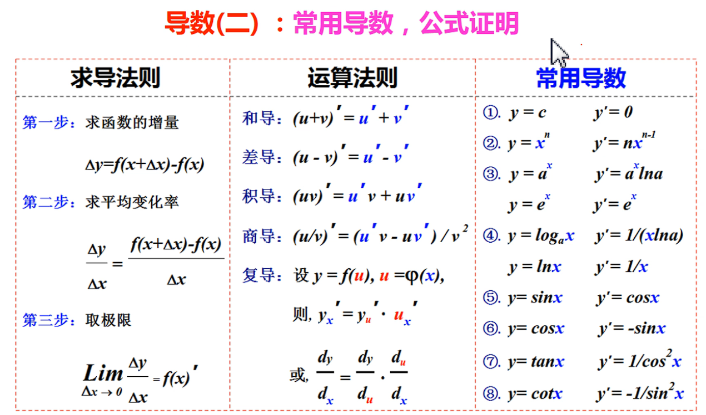
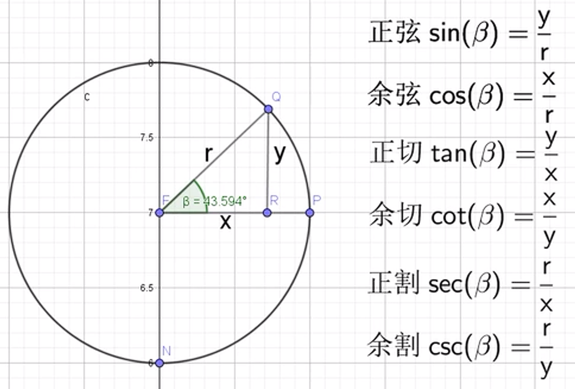

# 1. 求导公式
<div>

</div>

|  |  |  |  |  |  |
|--|--|--|--|--|--|
| $(\frac{1}{x})'=-\frac{1}{x^2}$ | $(\tan{x})'=\sec^2{x}$ | $(\arcsin{x})'=\frac{1}{\sqrt{1-x^2}}$ |  |  |  |
| $(\sqrt{x})'=\frac{1}{2\sqrt{x}}$ | $(\cot{x})'=-\csc^2{x}$ | $(\arccos{x})'=-\frac{1}{\sqrt{1-x^2}}$ |  |  |  |
| $[\ln{(x+\sqrt{x^2 \pm a^2})}]'=\frac{1}{\sqrt{x^2 \pm a^2}}$ | $(\sec{x})'=\sec{x}\tan{x}$ | $(\arctan{x})'=\frac{1}{1+x^2}$ |  |  |  |
|  | $(\csc{x})'=-\csc{x}\cot{x}$ | $(\arcctg{x})'=-\frac{1}{1+x^2}$ |  |  |  |
|  |  |  |  |  |  |
# 2. 一元二次方程
$ax^2+bx+c=0$  
$\Delta=b^2-4ac$  
$\begin{cases}
\Delta\geqslant0, x_{1,2}={\frac {-b{\pm}{\sqrt\Delta}}{2a}}   \\
   \Delta<0, 无实数根
\end{cases}$  
根与系数的关系（韦达定理）：  
$\begin{cases}
x_1+x_2=-\frac b a  \\
x_1x_2=\frac c a  
\end{cases}$
# 3. 因式分解
$a^2-b^2=(a+b)(a-b)$  
$a^3\pm b^3=(a\pm b)(a^2\mp ab+b^2)$  
$(a\pm b)^2=a^2\pm 2ab+b^2$  
$(a\pm b)^3=a^3\pm 3a^2b+3ab^2\pm b^3$  
# 4. 三角函数
<div>

</div>

```
正弦，sin，sine [saɪn]
余弦，cos，cosine [ˈkəʊsaɪn]
正切，tan，tangent [ˈtændʒənt]
余切，cot，cotangent
正割，sec，secant [ˈsiːkənt]
余割，csc，cosecant
```
## 4.1. 常用结果
|  |  |  |  |  |  |
|--|--|--|--|--|--|
|  | $0$ | $\frac{\pi}{6}(30°)$ | $\frac{\pi}{4}(45°)$ | $\frac{\pi}{3}(60°)$ | $\frac{\pi}{2}(90°)$ |
| $\sin$  | $0$ | $\frac{1}{2}$ | $\frac{\sqrt{2}}{2}$ | $\frac{\sqrt{3}}{2}$ | $1$ |
| $\cos$  | $1$ | $\frac{\sqrt{3}}{2}$ | $\frac{\sqrt{2}}{2}$ | $\frac{1}{2}$ | $0$ |
| $\tan$  | $0$ | $\frac{\sqrt{3}}{3}$ | $1$ | $\sqrt{3}$ | $\infin$ |
| $\cot$  | $\infin$ | $\sqrt{3}$ | $1$ | $\frac{\sqrt{3}}{3}$ | $0$ |
|  |  |  |  |  |  |